# [📈 Live Status](https://solutions2az.github.io/workermanager2az-status): <!--live status--> **🟩 All systems operational**

This repository contains the open-source uptime monitor and status page for [Solutions2AZ](https://www.solutions2az.net), powered by [Upptime](https://github.com/upptime/upptime).

With [Upptime](https://upptime.js.org), you can get your own unlimited and free uptime monitor and status page, powered entirely by a GitHub repository. We use [Issues](https://github.com/solutions2az/workermanager2az-status/issues) as incident reports, [Actions](https://github.com/solutions2az/workermanager2az-status/actions) as uptime monitors, and [Pages](https://solutions2az.github.io/workermanager2az-status) for the status page.

<!--start: status pages-->
<!-- This summary is generated by Upptime (https://github.com/upptime/upptime) -->
<!-- Do not edit this manually, your changes will be overwritten -->
<!-- prettier-ignore -->
| URL | Status | History | Response Time | Uptime |
| --- | ------ | ------- | ------------- | ------ |
|  [Demo AhoraFicho.es](https://demo.ahoraficho.es) | 🟩 Up | [demo-ahora-ficho-es.yml](https://github.com/WorkerManager2AZ/workermanager2az-status/commits/HEAD/history/demo-ahora-ficho-es.yml) | 

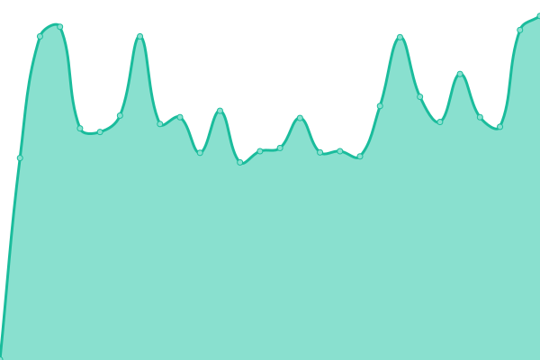 1415ms
     
 | 

<a href="https://workermanager2az.github.io/workermanager2az-status/history/demo-ahora-ficho-es">100.00%</a>
    

|  [Polaris](https://intranet.polaris.es) | 🟩 Up | [polaris.yml](https://github.com/WorkerManager2AZ/workermanager2az-status/commits/HEAD/history/polaris.yml) | 

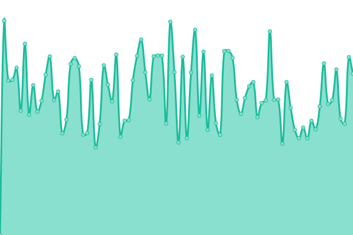 983ms
     
 | 

<a href="https://workermanager2az.github.io/workermanager2az-status/history/polaris">100.00%</a>
    

|  [Armanext](https://intranet.armanext.com) | 🟩 Up | [armanext.yml](https://github.com/WorkerManager2AZ/workermanager2az-status/commits/HEAD/history/armanext.yml) | 

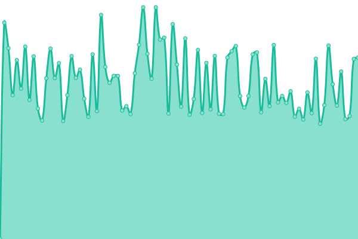 793ms
     
 | 

<a href="https://workermanager2az.github.io/workermanager2az-status/history/armanext">100.00%</a>
    

|  [Fundacion Del Valle](https://intranet.fundaciondelvalle.org) | 🟩 Up | [fundacion-del-valle.yml](https://github.com/WorkerManager2AZ/workermanager2az-status/commits/HEAD/history/fundacion-del-valle.yml) | 

 1172ms
     
 | 

<a href="https://workermanager2az.github.io/workermanager2az-status/history/fundacion-del-valle">100.00%</a>
    

|  [NextAbogados](https://intranet.nextabogados.com) | 🟩 Up | [next-abogados.yml](https://github.com/WorkerManager2AZ/workermanager2az-status/commits/HEAD/history/next-abogados.yml) | 

 1064ms
     
 | 

<a href="https://workermanager2az.github.io/workermanager2az-status/history/next-abogados">100.00%</a>
    

|  [Silon Aviación](https://silonaviacion.wm2az.solutions2az.net) | 🟩 Up | [silon-aviacion.yml](https://github.com/WorkerManager2AZ/workermanager2az-status/commits/HEAD/history/silon-aviacion.yml) | 

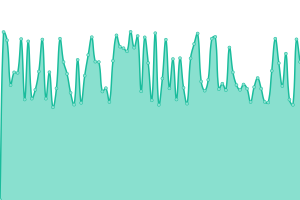 1336ms
     
 | 

<a href="https://workermanager2az.github.io/workermanager2az-status/history/silon-aviacion">100.00%</a>
    

|  [ENJ Consultores](https://intranet.enjconsultores.es) | 🟩 Up | [enj-consultores.yml](https://github.com/WorkerManager2AZ/workermanager2az-status/commits/HEAD/history/enj-consultores.yml) | 

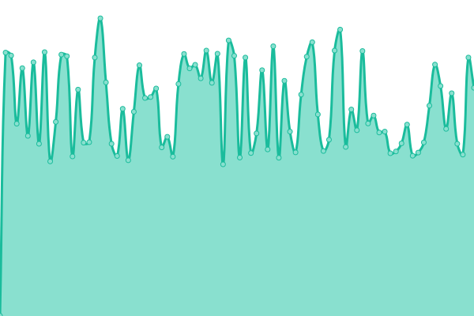 952ms
     
 | 

<a href="https://workermanager2az.github.io/workermanager2az-status/history/enj-consultores">100.00%</a>
    

|  [Imagetours](https://intranet.imagetours.es) | 🟩 Up | [imagetours.yml](https://github.com/WorkerManager2AZ/workermanager2az-status/commits/HEAD/history/imagetours.yml) | 

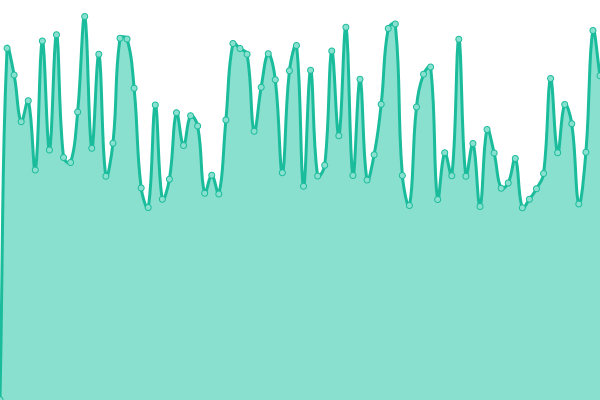 1129ms
     
 | 

<a href="https://workermanager2az.github.io/workermanager2az-status/history/imagetours">100.00%</a>
    

|  [Inelter Casar](https://ineltercasar.ahoraficho.es) | 🟩 Up | [inelter-casar.yml](https://github.com/WorkerManager2AZ/workermanager2az-status/commits/HEAD/history/inelter-casar.yml) | 

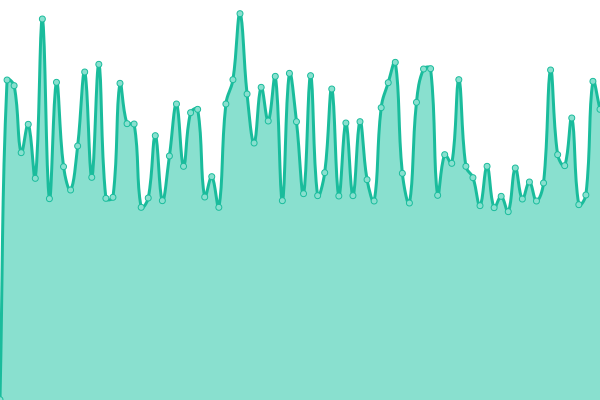 752ms
     
 | 

<a href="https://workermanager2az.github.io/workermanager2az-status/history/inelter-casar">100.00%</a>
    

|  [LT Estilistas](https://ltestilistas.ahoraficho.es) | 🟩 Up | [lt-estilistas.yml](https://github.com/WorkerManager2AZ/workermanager2az-status/commits/HEAD/history/lt-estilistas.yml) | 

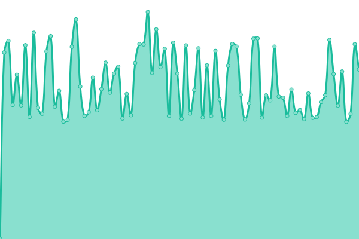 686ms
     
 | 

<a href="https://workermanager2az.github.io/workermanager2az-status/history/lt-estilistas">100.00%</a>
    

|  [Interactive Club](https://interactiveclub.ahoraficho.es) | 🟩 Up | [interactive-club.yml](https://github.com/WorkerManager2AZ/workermanager2az-status/commits/HEAD/history/interactive-club.yml) | 

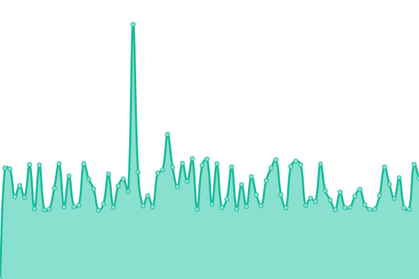 709ms
     
 | 

<a href="https://workermanager2az.github.io/workermanager2az-status/history/interactive-club">100.00%</a>
    

|  [Escolactiva Lugo](https://escolactivalugo.ahoraficho.es) | 🟩 Up | [escolactiva-lugo.yml](https://github.com/WorkerManager2AZ/workermanager2az-status/commits/HEAD/history/escolactiva-lugo.yml) | 

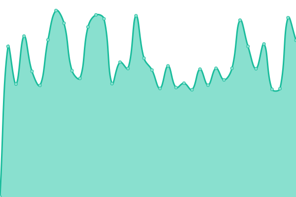 637ms
     
 | 

<a href="https://workermanager2az.github.io/workermanager2az-status/history/escolactiva-lugo">100.00%</a>
    

|  [SGD Me Cuida](https://sgdmecuida.ahoraficho.es) | 🟩 Up | [sgd-me-cuida.yml](https://github.com/WorkerManager2AZ/workermanager2az-status/commits/HEAD/history/sgd-me-cuida.yml) | 

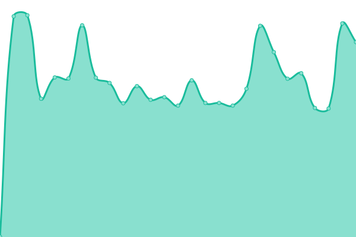 646ms
     
 | 

<a href="https://workermanager2az.github.io/workermanager2az-status/history/sgd-me-cuida">100.00%</a>
    

|  [Alfalfa Spain](https://alfalfaspain.ahoraficho.es) | 🟩 Up | [alfalfa-spain.yml](https://github.com/WorkerManager2AZ/workermanager2az-status/commits/HEAD/history/alfalfa-spain.yml) | 

 644ms
     
 | 

<a href="https://workermanager2az.github.io/workermanager2az-status/history/alfalfa-spain">100.00%</a>
    

|  [Ad-Lante Marketing](https://ad-lante.ahoraficho.es) | 🟩 Up | [ad-lante-marketing.yml](https://github.com/WorkerManager2AZ/workermanager2az-status/commits/HEAD/history/ad-lante-marketing.yml) | 

 641ms
     
 | 

<a href="https://workermanager2az.github.io/workermanager2az-status/history/ad-lante-marketing">100.00%</a>
    

|  [Barracuda YD](https://barracuda-yd.ahoraficho.es) | 🟩 Up | [barracuda-yd.yml](https://github.com/WorkerManager2AZ/workermanager2az-status/commits/HEAD/history/barracuda-yd.yml) | 

 635ms
     
 | 

<a href="https://workermanager2az.github.io/workermanager2az-status/history/barracuda-yd">100.00%</a>
    

|  [Arsai Guarderia](https://arsaiguarderia.ahoraficho.es) | 🟩 Up | [arsai-guarderia.yml](https://github.com/WorkerManager2AZ/workermanager2az-status/commits/HEAD/history/arsai-guarderia.yml) | 

 640ms
     
 | 

<a href="https://workermanager2az.github.io/workermanager2az-status/history/arsai-guarderia">100.00%</a>
    

|  [Theming Profile](https://themingprofile.ahoraficho.es) | 🟩 Up | [theming-profile.yml](https://github.com/WorkerManager2AZ/workermanager2az-status/commits/HEAD/history/theming-profile.yml) | 

 503ms
     
 | 

<a href="https://workermanager2az.github.io/workermanager2az-status/history/theming-profile">100.00%</a>
    

|  [S2PI Servicios de Prevención](https://s2pi.ahoraficho.es) | 🟩 Up | [s2-pi-servicios-de-prevencion.yml](https://github.com/WorkerManager2AZ/workermanager2az-status/commits/HEAD/history/s2-pi-servicios-de-prevencion.yml) | 

 634ms
     
 | 

<a href="https://workermanager2az.github.io/workermanager2az-status/history/s2-pi-servicios-de-prevencion">100.00%</a>
    

|  [Perez Cardoso](https://perezcardoso.ahoraficho.es) | 🟩 Up | [perez-cardoso.yml](https://github.com/WorkerManager2AZ/workermanager2az-status/commits/HEAD/history/perez-cardoso.yml) | 

 635ms
     
 | 

<a href="https://workermanager2az.github.io/workermanager2az-status/history/perez-cardoso">100.00%</a>
    

|  [Eletur Ascensores](https://eletur.ahoraficho.es) | 🟩 Up | [eletur-ascensores.yml](https://github.com/WorkerManager2AZ/workermanager2az-status/commits/HEAD/history/eletur-ascensores.yml) | 

 639ms
     
 | 

<a href="https://workermanager2az.github.io/workermanager2az-status/history/eletur-ascensores">100.00%</a>
    

|  [Agribripe](https://agribripe.ahoraficho.es) | 🟩 Up | [agribripe.yml](https://github.com/WorkerManager2AZ/workermanager2az-status/commits/HEAD/history/agribripe.yml) | 

 638ms
     
 | 

<a href="https://workermanager2az.github.io/workermanager2az-status/history/agribripe">100.00%</a>
    

|  [FHM Instalaciones](https://fmh-instalaciones.ahoraficho.es) | 🟩 Up | [fhm-instalaciones.yml](https://github.com/WorkerManager2AZ/workermanager2az-status/commits/HEAD/history/fhm-instalaciones.yml) | 

 633ms
     
 | 

<a href="https://workermanager2az.github.io/workermanager2az-status/history/fhm-instalaciones">100.00%</a>
    

|  [Demo 2 AhoraFicho.es](https://demo2.ahoraficho.es) | 🟩 Up | [demo-2-ahora-ficho-es.yml](https://github.com/WorkerManager2AZ/workermanager2az-status/commits/HEAD/history/demo-2-ahora-ficho-es.yml) | 

 639ms
     
 | 

<a href="https://workermanager2az.github.io/workermanager2az-status/history/demo-2-ahora-ficho-es">100.00%</a>
    

|  [Instituto Internacional Puerto Real](https://instituto-internacional-puertoreal.ahoraficho.es) | 🟩 Up | [instituto-internacional-puerto-real.yml](https://github.com/WorkerManager2AZ/workermanager2az-status/commits/HEAD/history/instituto-internacional-puerto-real.yml) | 

 633ms
     
 | 

<a href="https://workermanager2az.github.io/workermanager2az-status/history/instituto-internacional-puerto-real">100.00%</a>
    

|  [Demo Carhaus](https://democarhaus.ahoraficho.es) | 🟩 Up | [demo-carhaus.yml](https://github.com/WorkerManager2AZ/workermanager2az-status/commits/HEAD/history/demo-carhaus.yml) | 

 629ms
     
 | 

<a href="https://workermanager2az.github.io/workermanager2az-status/history/demo-carhaus">100.00%</a>
    

|  [IPEC Centro](https://ipeccentro.ahoraficho.es) | 🟩 Up | [ipec-centro.yml](https://github.com/WorkerManager2AZ/workermanager2az-status/commits/HEAD/history/ipec-centro.yml) | 

 634ms
     
 | 

<a href="https://workermanager2az.github.io/workermanager2az-status/history/ipec-centro">100.00%</a>
    

|  [Arboristas del Sur](https://arboristasdelsur.ahoraficho.es) | 🟩 Up | [arboristas-del-sur.yml](https://github.com/WorkerManager2AZ/workermanager2az-status/commits/HEAD/history/arboristas-del-sur.yml) | 

 629ms
     
 | 

<a href="https://workermanager2az.github.io/workermanager2az-status/history/arboristas-del-sur">100.00%</a>
    

|  [Campo de Gibraltar](https://campodegibraltar.ahoraficho.es) | 🟩 Up | [campo-de-gibraltar.yml](https://github.com/WorkerManager2AZ/workermanager2az-status/commits/HEAD/history/campo-de-gibraltar.yml) | 

 631ms
     
 | 

<a href="https://workermanager2az.github.io/workermanager2az-status/history/campo-de-gibraltar">100.00%</a>
    

|  [Taller Sanchez Ibañez](https://tallersanchezibanez.ahoraficho.es) | 🟩 Up | [taller-sanchez-ibanez.yml](https://github.com/WorkerManager2AZ/workermanager2az-status/commits/HEAD/history/taller-sanchez-ibanez.yml) | 

 635ms
     
 | 

<a href="https://workermanager2az.github.io/workermanager2az-status/history/taller-sanchez-ibanez">100.00%</a>
    

|  [Guts and Love](https://gutsandlove.ahoraficho.es) | 🟩 Up | [guts-and-love.yml](https://github.com/WorkerManager2AZ/workermanager2az-status/commits/HEAD/history/guts-and-love.yml) | 

 631ms
     
 | 

<a href="https://workermanager2az.github.io/workermanager2az-status/history/guts-and-love">100.00%</a>
    

|  [Tila Bakes Pasteleria](https://tilabakes.ahoraficho.es) | 🟩 Up | [tila-bakes-pasteleria.yml](https://github.com/WorkerManager2AZ/workermanager2az-status/commits/HEAD/history/tila-bakes-pasteleria.yml) | 

 692ms
     
 | 

<a href="https://workermanager2az.github.io/workermanager2az-status/history/tila-bakes-pasteleria">100.00%</a>
    

<!--end: status pages-->

[**Visit our status website →**](https://solutions2az.github.io/workermanager2az-status)

## 📄 License

- Powered by: [Upptime](https://github.com/upptime/upptime)
- Code: [MIT](./LICENSE) © [Anand Chowdhary](https://anandchowdhary.com), supported by [Pabio](https://pabio.com)
- Data in the `./history` directory: [Open Database License](https://opendatacommons.org/licenses/odbl/1-0/)
