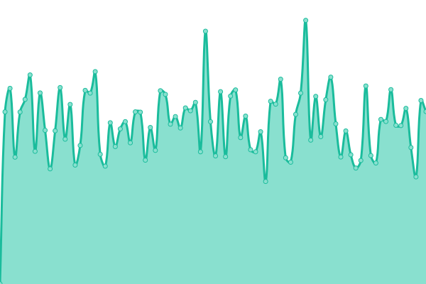

# [📈 Live Status](https://solutions2az.github.io/workermanager2az-status): <!--live status--> **🟩 All systems operational**

This repository contains the open-source uptime monitor and status page for [Solutions2AZ](https://www.solutions2az.net), powered by [Upptime](https://github.com/upptime/upptime).

With [Upptime](https://upptime.js.org), you can get your own unlimited and free uptime monitor and status page, powered entirely by a GitHub repository. We use [Issues](https://github.com/solutions2az/workermanager2az-status/issues) as incident reports, [Actions](https://github.com/solutions2az/workermanager2az-status/actions) as uptime monitors, and [Pages](https://solutions2az.github.io/workermanager2az-status) for the status page.

<!--start: status pages-->
<!-- This summary is generated by Upptime (https://github.com/upptime/upptime) -->
<!-- Do not edit this manually, your changes will be overwritten -->
<!-- prettier-ignore -->
| URL | Status | History | Response Time | Uptime |
| --- | ------ | ------- | ------------- | ------ |
|  [Demo AhoraFicho.es](https://demo.ahoraficho.es) | 🟩 Up | [demo-ahora-ficho-es.yml](https://github.com/WorkerManager2AZ/workermanager2az-status/commits/HEAD/history/demo-ahora-ficho-es.yml) | 

 739ms
     
 | 

<a href="https://workermanager2az.github.io/workermanager2az-status/history/demo-ahora-ficho-es">100.00%</a>
    

|  [Polaris](https://intranet.polaris.es) | 🟩 Up | [polaris.yml](https://github.com/WorkerManager2AZ/workermanager2az-status/commits/HEAD/history/polaris.yml) | 

 1006ms
     
 | 

<a href="https://workermanager2az.github.io/workermanager2az-status/history/polaris">100.00%</a>
    

|  [Armanext](https://intranet.armanext.com) | 🟩 Up | [armanext.yml](https://github.com/WorkerManager2AZ/workermanager2az-status/commits/HEAD/history/armanext.yml) | 

 803ms
     
 | 

<a href="https://workermanager2az.github.io/workermanager2az-status/history/armanext">100.00%</a>
    

|  [Fundacion Del Valle](https://intranet.fundaciondelvalle.org) | 🟩 Up | [fundacion-del-valle.yml](https://github.com/WorkerManager2AZ/workermanager2az-status/commits/HEAD/history/fundacion-del-valle.yml) | 

 1184ms
     
 | 

<a href="https://workermanager2az.github.io/workermanager2az-status/history/fundacion-del-valle">100.00%</a>
    

|  [NextAbogados](https://intranet.nextabogados.com) | 🟩 Up | [next-abogados.yml](https://github.com/WorkerManager2AZ/workermanager2az-status/commits/HEAD/history/next-abogados.yml) | 

 1077ms
     
 | 

<a href="https://workermanager2az.github.io/workermanager2az-status/history/next-abogados">100.00%</a>
    

|  [Silon Aviación](https://silonaviacion.wm2az.solutions2az.net) | 🟩 Up | [silon-aviacion.yml](https://github.com/WorkerManager2AZ/workermanager2az-status/commits/HEAD/history/silon-aviacion.yml) | 

 805ms
     
 | 

<a href="https://workermanager2az.github.io/workermanager2az-status/history/silon-aviacion">100.00%</a>
    

|  [ENJ Consultores](https://intranet.enjconsultores.es) | 🟩 Up | [enj-consultores.yml](https://github.com/WorkerManager2AZ/workermanager2az-status/commits/HEAD/history/enj-consultores.yml) | 

 969ms
     
 | 

<a href="https://workermanager2az.github.io/workermanager2az-status/history/enj-consultores">100.00%</a>
    

|  [Imagetours](https://intranet.imagetours.es) | 🟩 Up | [imagetours.yml](https://github.com/WorkerManager2AZ/workermanager2az-status/commits/HEAD/history/imagetours.yml) | 

 1213ms
     
 | 

<a href="https://workermanager2az.github.io/workermanager2az-status/history/imagetours">100.00%</a>
    

|  [Inelter Casar](https://ineltercasar.ahoraficho.es) | 🟩 Up | [inelter-casar.yml](https://github.com/WorkerManager2AZ/workermanager2az-status/commits/HEAD/history/inelter-casar.yml) | 

 844ms
     
 | 

<a href="https://workermanager2az.github.io/workermanager2az-status/history/inelter-casar">100.00%</a>
    

|  [LT Estilistas](https://ltestilistas.ahoraficho.es) | 🟩 Up | [lt-estilistas.yml](https://github.com/WorkerManager2AZ/workermanager2az-status/commits/HEAD/history/lt-estilistas.yml) | 

 763ms
     
 | 

<a href="https://workermanager2az.github.io/workermanager2az-status/history/lt-estilistas">95.32%</a>
    

|  [Interactive Club](https://interactiveclub.ahoraficho.es) | 🟩 Up | [interactive-club.yml](https://github.com/WorkerManager2AZ/workermanager2az-status/commits/HEAD/history/interactive-club.yml) | 

 723ms
     
 | 

<a href="https://workermanager2az.github.io/workermanager2az-status/history/interactive-club">100.00%</a>
    

<!--end: status pages-->

[**Visit our status website →**](https://solutions2az.github.io/workermanager2az-status)

## 📄 License

- Powered by: [Upptime](https://github.com/upptime/upptime)
- Code: [MIT](./LICENSE) © [Anand Chowdhary](https://anandchowdhary.com), supported by [Pabio](https://pabio.com)
- Data in the `./history` directory: [Open Database License](https://opendatacommons.org/licenses/odbl/1-0/)
